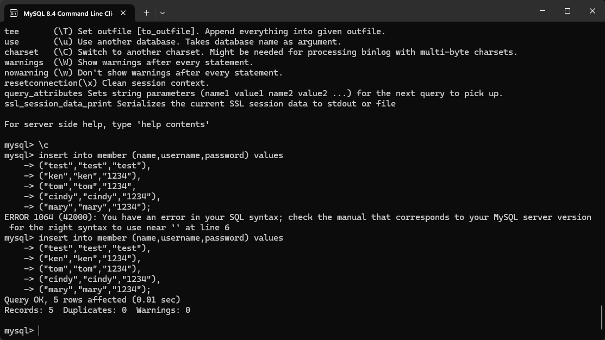
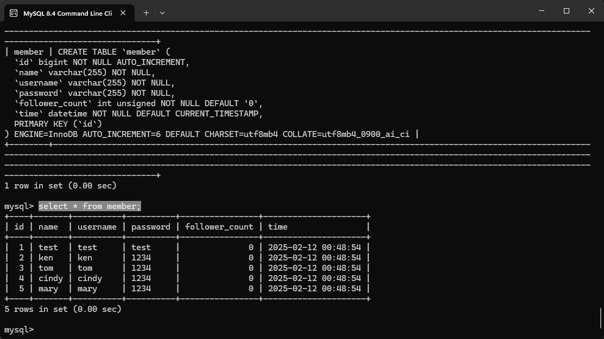
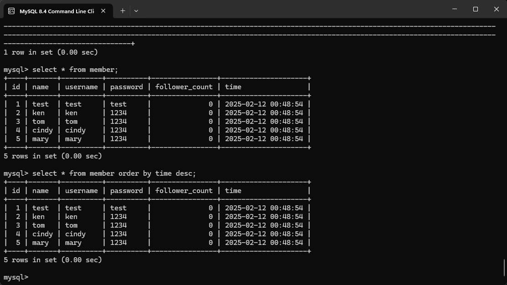
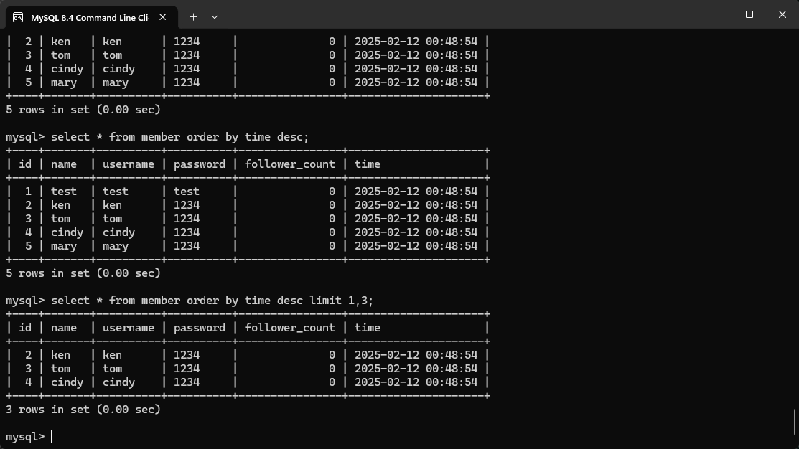
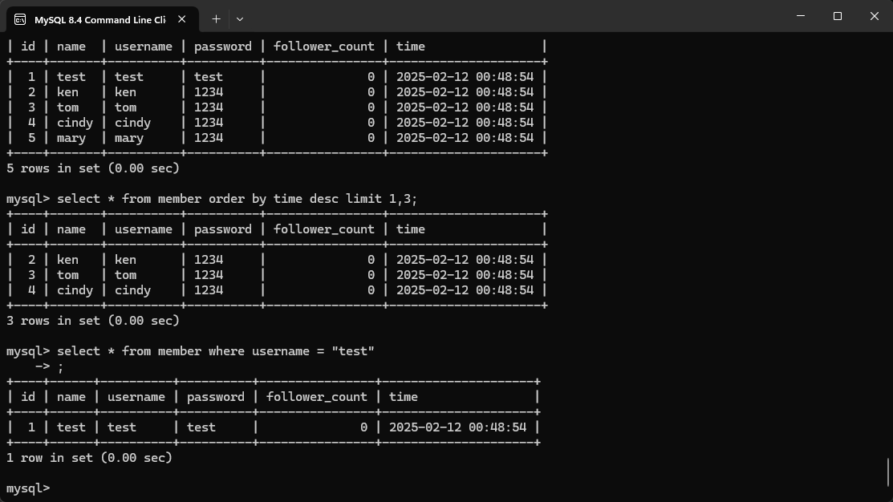
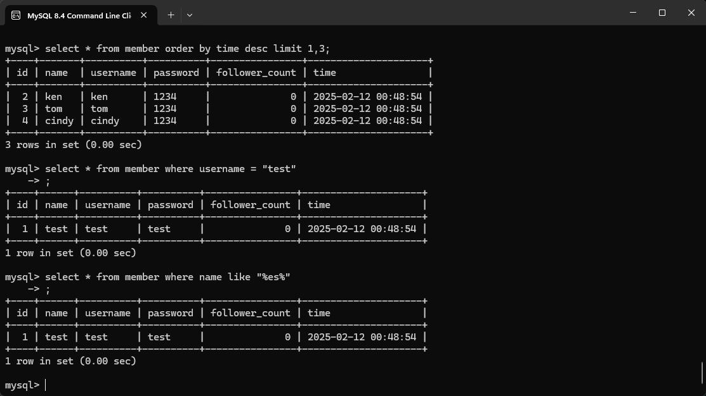
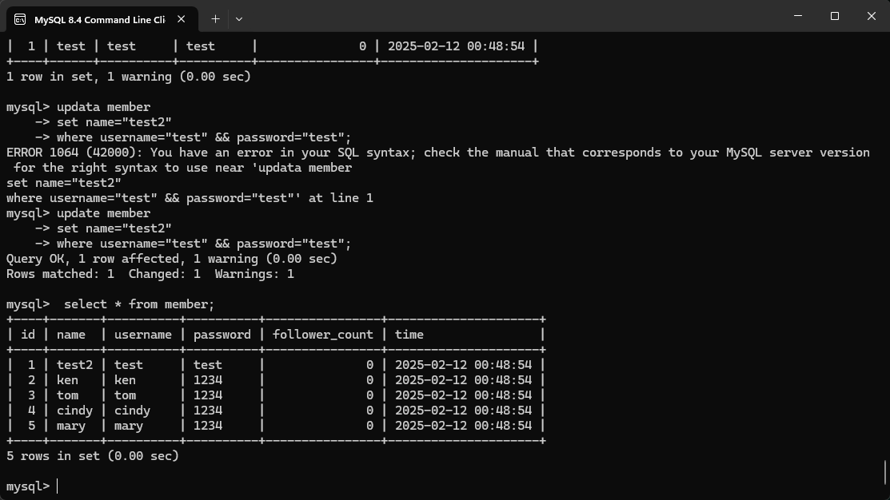

# Week5
## Task2.1 Create a new database named website.  
程式碼：  
`create database website;`  
  

## Task2.2 Create a new table named member, in the website database, designed as below:  
程式碼：  
``create table member(
id bigint auto_increment primary key, 
name varchar(255) not null, 
username varchar(255) not null, 
password varchar(255) not null, 
follower_count int unsigned not null default 0, 
time datetime not null default current_timestamp 
);``  

## Task3.1 INSERT a new row to the member table where name, username and password must be set to test. INSERT additional 4 rows with arbitrary data.  
程式碼：  
``mysql> insert into member (name,username,password) values
("test","test","test"), 
("ken","ken","1234"), 
("tom","tom","1234"), 
("cindy","cindy","1234"), 
("mary","mary","1234");``  

## Task3.2 SELECT all rows from the member table.  
程式碼：  
``select * from member;``  
  

## Task3.3 SELECT all rows from the member table, in descending order of time.  
程式碼：  
``select * from member order by time desc;``  
  

## Task3.4 SELECT total 3 rows, second to fourth, from the member table, in descending order of time. Note: it does not mean SELECT rows where id are 2, 3, or 4.  
程式碼：  
``select * from member order by time desc limit 1,3;``  
  

## Task3.5 SELECT rows where username equals to test.   
程式碼：  
``select * from member where username = "test";``  
  

## Task3.6 SELECT rows where name includes the es keyword.   
程式碼：  
``select * from member where name like "%es%“;``  
  

## Task3.7 SELECT rows where both username and password equal to test.  
程式碼：  
`` select * from member where username="test" && password="test";``  
  

## Task3.8 UPDATE data in name column to test2 where username equals to test.  
程式碼：  
``update member
set name="test2"
where username="test" && password="test";
``  
  

