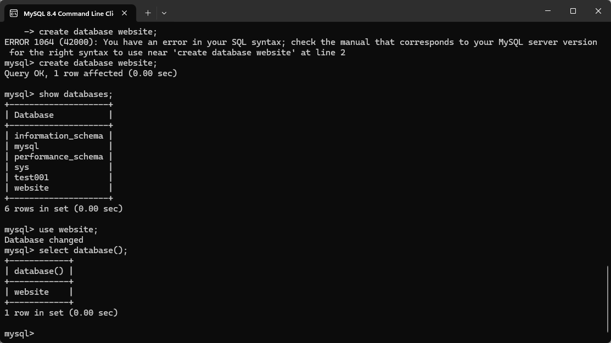
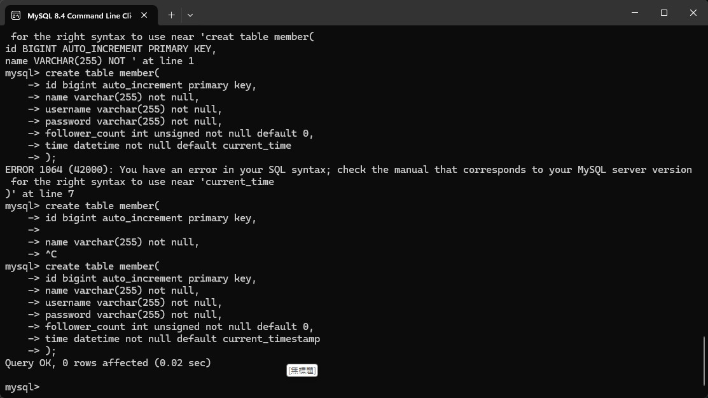

# Week5
## Task2.1 Create a new database named website.  
程式碼：  
`create database website;`  
  

## Task2.2 Create a new table named member, in the website database, designed as below:  
程式碼：  
``create table member(
id bigint auto_increment primary key, 
name varchar(255) not null, 
username varchar(255) not null, 
password varchar(255) not null, 
follower_count int unsigned not null default 0, 
time datetime not null default current_timestamp 
);``  

