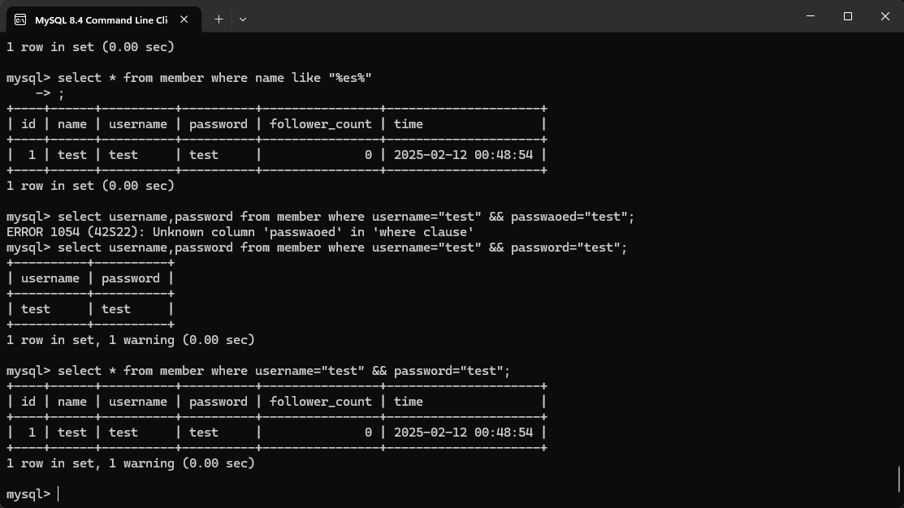
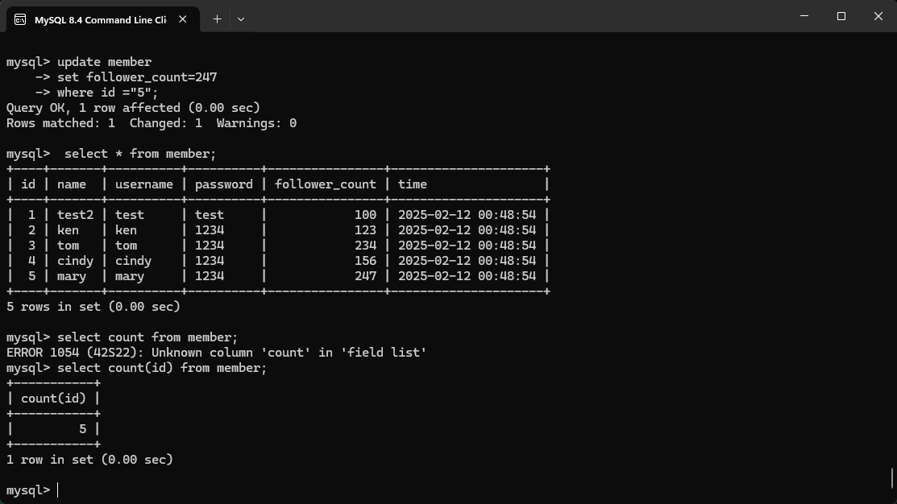
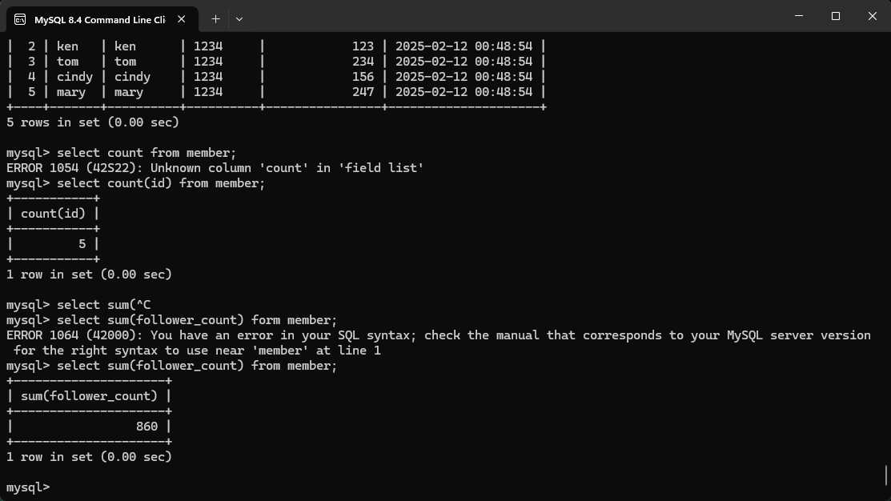
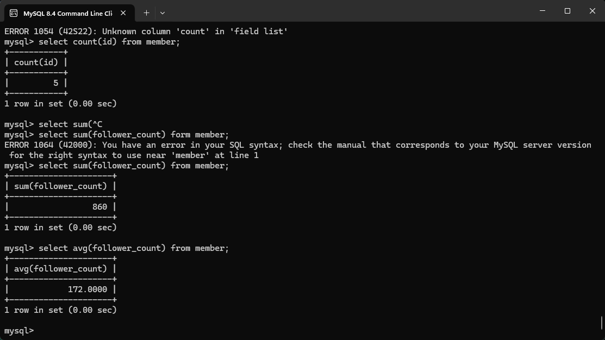
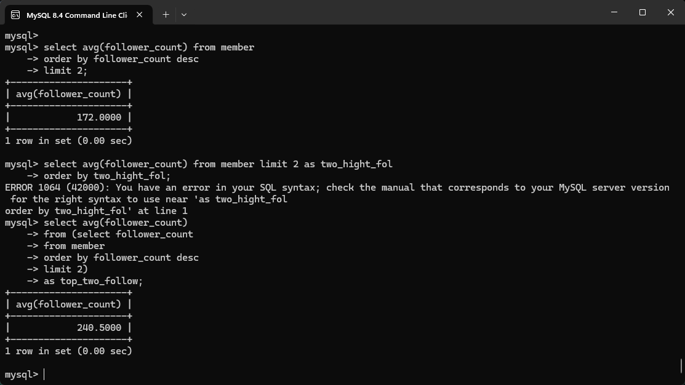
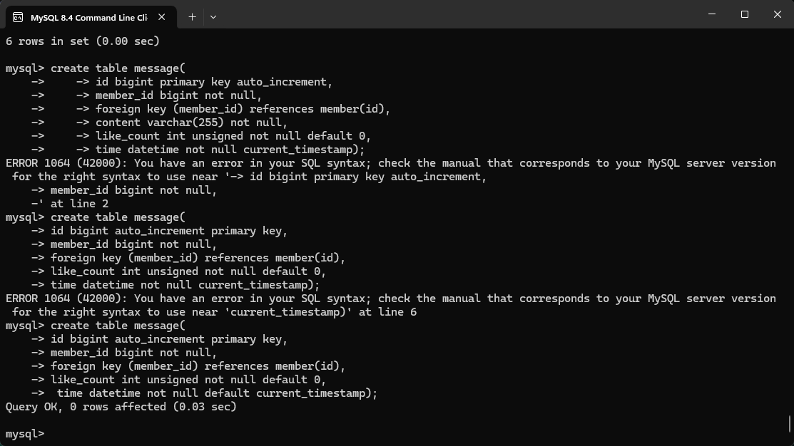
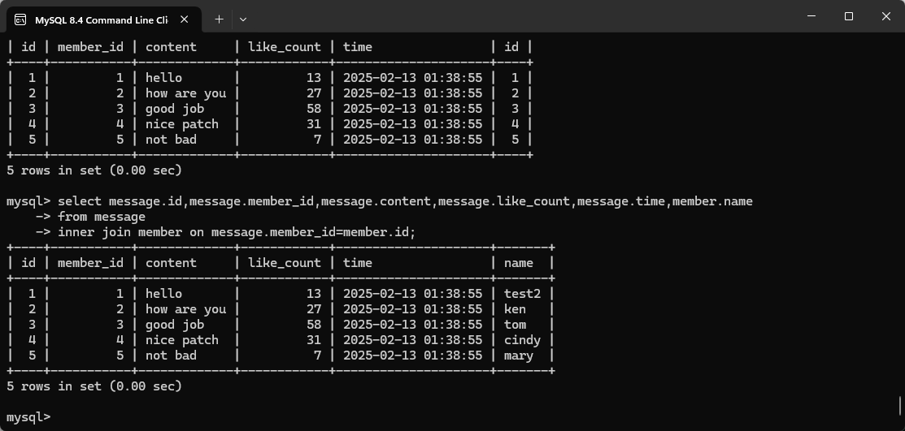
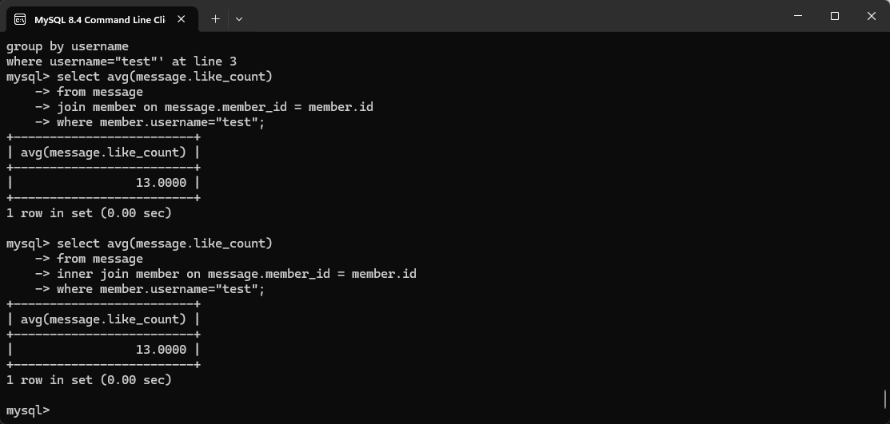
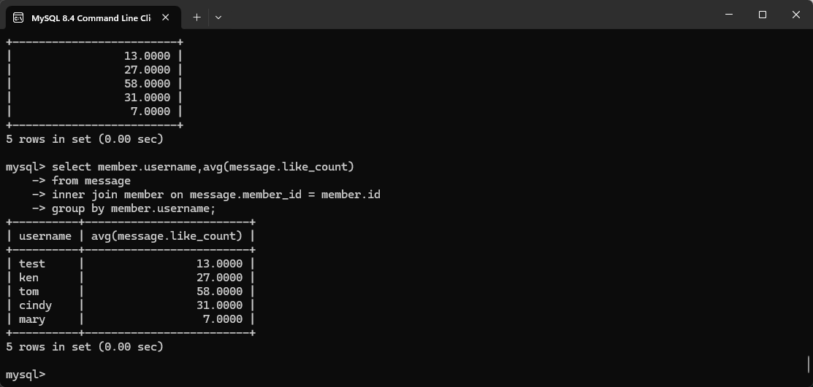

# Week5
## Task2.1 Create a new database named website.  
程式碼：  
`create database website;`  

  

## Task2.2 Create a new table named member, in the website database, designed as below:  
程式碼：  
``create table member(
id bigint auto_increment primary key, 
name varchar(255) not null, 
username varchar(255) not null, 
password varchar(255) not null, 
follower_count int unsigned not null default 0, 
time datetime not null default current_timestamp 
);``  

## Task3.1 INSERT a new row to the member table where name, username and password must be set to test. INSERT additional 4 rows with arbitrary data.  
程式碼：  
``mysql> insert into member (name,username,password) values
("test","test","test"), 
("ken","ken","1234"), 
("tom","tom","1234"), 
("cindy","cindy","1234"), 
("mary","mary","1234");``  

## Task3.2 SELECT all rows from the member table.  
程式碼：  
``select * from member;``  

  

## Task3.3 SELECT all rows from the member table, in descending order of time.  
程式碼：  
``select * from member order by time desc;``  

  

## Task3.4 SELECT total 3 rows, second to fourth, from the member table, in descending order of time. Note: it does not mean SELECT rows where id are 2, 3, or 4.  
程式碼：  
``select * from member order by time desc limit 1,3;``  

  

## Task3.5 SELECT rows where username equals to test.   
程式碼：  
``select * from member where username = "test";``  

  

## Task3.6 SELECT rows where name includes the es keyword.   
程式碼：  
``select * from member where name like "%es%“;``  

  

## Task3.7 SELECT rows where both username and password equal to test.  
程式碼：  
`` select * from member where username="test" && password="test";``  

  

## Task3.8 UPDATE data in name column to test2 where username equals to test.  
程式碼：  
``update member
set name="test2"
where username="test" && password="test";
``  
  

## Task3.9 SELECT how many rows from the member table.  
程式碼：  
``select count(id) from member;``  

  

## Task4.1 SELECT how many rows from the member table.  
程式碼：  
``select count(id) from member;``  

  

## Task4.2 SELECT the sum of follower_count of all the rows from the member table.  
程式碼：  
``select sum(follower_count) from member;``  

  

## Task4.3 SELECT the average of follower_count of all the rows from the member table.  
程式碼：  
``select avg(follower_count) from member;``  

  

## Task4.4 SELECT the average of follower_count of the first 2 rows, in descending order of follower_count, from the member table..  
程式碼：  
``select avg(follower_count) 
from (select follower_count 
from member 
order by follower_count desc 
limit 2) 
as top_two_follow; 
``  

  

## Task5.1 Create a new table named message, in the website database.  
程式碼：  
``create table message( 
id bigint auto_increment primary key, 
member_id bigint not null, 
content varchar(255) not null, 
foreign key (member_id) references member(id), 
like_count int unsigned not null default 0, 
time datetime not null default current_timestamp); 
``  

  

## Task5.2 SELECT all messages, including sender names. We have to JOIN the member table to get that.  
程式碼：  
``select message.id,message.member_id,message.content,message.like_count,message.time,member.name 
from message 
inner join member on message.member_id=member.id; 
``  

  

## Task5.3 SELECT all messages, including sender names, where sender username equals to test. We have to JOIN the member table to filter and get that.  
程式碼：  
``select * from (select message.id,message.member_id,message.content,message.like_count,message.time,member.username
from message
inner join member on message.member_id=member.id)
as sender_message
where username="test"; 
``  

  

## Task5.4 Use SELECT, SQL Aggregation Functions with JOIN statement, get the average like count of messages where sender username equals to test..  
程式碼：  
``select avg(message.like_count) 
from message 
inner join member on message.member_id = member.id 
where member.username="test"; 
``  

  

## Task5.5 Use SELECT, SQL Aggregation Functions with JOIN statement, get the average like count of messages GROUP BY sender username..  
程式碼：  
``select member.username,avg(message.like_count)
from message
inner join member on message.member_id = member.id
group by member.username;
``  

  

